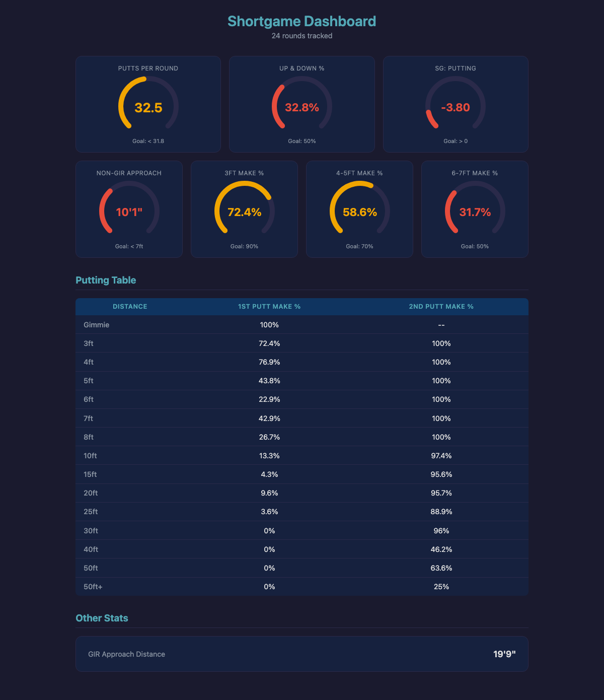

# Shortgame Dashboard

Personal golf putting tracker that goes deeper than what The Grint provides. Log every putt distance per hole via a Telegram bot during your round, then view detailed performance metrics on a web dashboard.



## What It Tracks

| Metric | Description | Goal |
|--------|-------------|------|
| Putts Per Round | Average across all rounds | < 31.8 |
| Up & Down % | 1-putt rate after missing the green | 50% |
| Non-GIR Approach | How close your chips/pitches finish | < 7ft |
| SG: Putting | Strokes Gained vs PGA Tour baseline (Broadie) | > 0 |
| Make % (3ft) | First-putt conversion at 3ft | 90% |
| Make % (4-5ft) | First-putt conversion at 4-5ft | 70% |
| Make % (6-7ft) | First-putt conversion at 6-7ft | 50% |

Plus a full putting table showing 1st putt make % and 2-putt conversion rate at every distance from Gimmie through 50ft+.

## How It Works

**On the course:** Send `/round` to the Telegram bot. For each hole, tap inline buttons to log your first putt distance, GIR status, and subsequent putts. "Made It!" means the previous putt went in. Data is saved per-hole so nothing is lost if you lose signal.

**At home:** Open the dashboard in a browser to see your stats visualized with color-coded circular gauges (green = meeting goal, amber = close, red = needs work).

**Seed data:** 24 rounds of simulated data calibrated to your Grint averages are pre-loaded so the dashboard is useful from day one. New rounds are automatically blended into the averages.

## Architecture

A single Python process (FastAPI + uvicorn) serves everything:

- **Telegram bot** - Inline keyboard conversation flow for hole-by-hole data entry
- **REST API** (`GET /api/stats`) - Computes all dashboard statistics from SQLite
- **Static frontend** (`/`) - Vanilla HTML/CSS/JS with SVG gauges, no build step

```
backend/
  main.py              # FastAPI app, lifespan, webhook endpoint
  bot/handlers.py      # ConversationHandler state machine
  bot/keyboards.py     # Inline keyboard builders
  services/stats_service.py  # All stat calculations
  storage/database.py  # SQLModel models (Round, Hole, Putt)
  constants.py         # Distances, SG baselines, goals
frontend/
  index.html           # Dashboard page
  css/dashboard.css    # Dark theme, responsive grid
  js/gauge.js          # SVG circular gauge component
  js/app.js            # Fetch stats, render dashboard
scripts/
  seed_dummy_data.py   # Generate 24 calibrated seed rounds
```

## Setup

### Prerequisites

- Python 3.13+
- A Telegram bot token from [@BotFather](https://t.me/BotFather) (optional for dashboard-only use)

### Quick Start

```bash
# Clone and install
git clone https://github.com/kevinmcmahonxyz/shortgame-dashboard.git
cd shortgame-dashboard
python3 -m venv .venv
source .venv/bin/activate
pip install -r requirements.txt

# Configure (optional - bot works without token, dashboard still shows seed data)
cp .env.example .env
# Edit .env with your TELEGRAM_BOT_TOKEN

# Seed historical data and run
python -m scripts.seed_dummy_data
uvicorn backend.main:app --port 8000
```

Open **http://localhost:8000** to view the dashboard.

### Docker

```bash
cp .env.example .env
# Edit .env with your TELEGRAM_BOT_TOKEN
docker compose up
```

### Bot Modes

| Mode | Use Case | Config |
|------|----------|--------|
| `polling` | Local dev, no public URL needed | `BOT_MODE=polling` |
| `webhook` | Production, requires HTTPS URL | `BOT_MODE=webhook` + `WEBHOOK_URL=https://...` |

For webhook mode, expose port 8000 via Cloudflare Tunnel, ngrok, or similar.

## Tech Stack

- **FastAPI** - API + static file serving + webhook endpoint
- **python-telegram-bot** v21+ - Bot framework with inline keyboards
- **SQLModel** - ORM with SQLite backend
- **pydantic-settings** - Configuration from `.env`
- **Vanilla JS** - No build step, SVG-based gauges

## SG: Putting

Strokes Gained is calculated per hole as:

```
SG = expected_putts(first_putt_distance) - actual_putts_taken
```

Expected putts use PGA Tour baselines from Mark Broadie's research. A positive SG means you putted better than tour average from that distance; negative means worse. The dashboard shows the per-round average.
